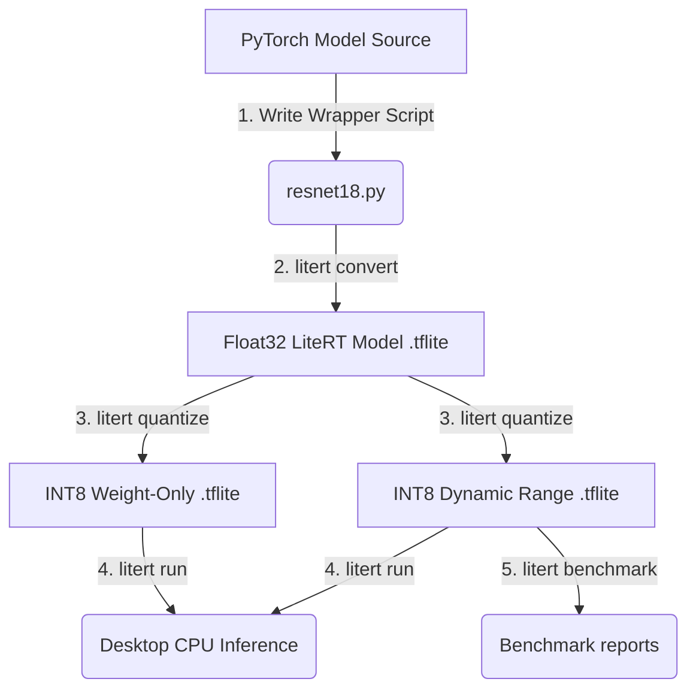
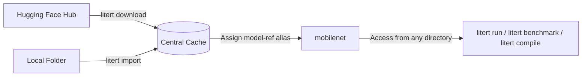
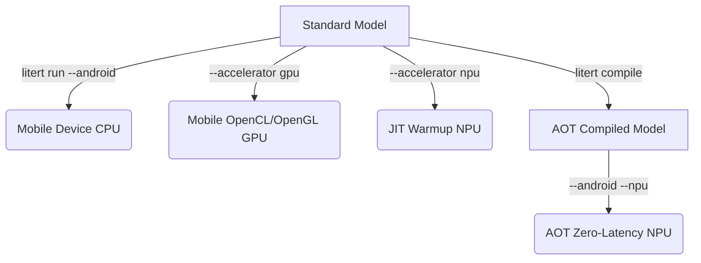

summary: A one-hour workshop codelab teaching LiteRT CLI 101, from basic usages
for beginners to convert and quantize models, to more tips like running
benchmarks on physical hardware, to advanced uses like agent prompts and cloud
testing. id: litert-cli-101 categories: Edge AI, LiteRT, Mobile ML tags:
workshop, codelab, litert-cli status: Draft authors: LiteRT CLI Team Feedback
Link: https://github.com/google-ai-edge/LiteRT-CLI/issues

# LiteRT CLI 101: Streamline your Edge AI Workflows

## 🏁 1. Introduction & CLI Overview

Duration: 5:00

Welcome to the **LiteRT CLI 101 Hands-on Workshop!** This guide is designed to
take you step-by-step from zero environment setup to deploying optimized edge
intelligence.

--------------------------------------------------------------------------------

### 🌟 Background & Evolution

Edge Machine Learning requires bringing complex neural models directly onto
mobile phones, wearables, and embedded hardware.

*   **[LiteRT](https://ai.google.dev/edge/litert)** (formerly **TensorFlow Lite
    / TFLite**) Google's on-device framework for high-performance ML & GenAI
    deployment on edge platforms, via efficient conversion, runtime, and
    optimization.
*   **LiteRT CLI** integrates Google AI Edge stacks into a standalone shell
    command (`litert`), to steamline LiteRT related development workflows,
    including converting, quantizing, compiling, running, benchmarking and
    visualizing LiteRT (TFLite) models on various hardware (CPU / GPU / NPU)
    across platforms (desktop, mobile, or cloud).

--------------------------------------------------------------------------------

## 🔄 2. Model Conversion Workflow

Duration: 15:00

In this section, let us execute a complete Edge AI modeling lifecycle with
LiteRT CLI: PyTorch wrapper mapping ➔ tracing conversion ➔ precision
quantization ➔ desktop execution ➔ browser-based graph visualization.

> [!NOTE] For interactive Jupyter Notebook support of this section, please try
> [run as a notebook](https://github.com/google-ai-edge/LiteRT-CLI/blob/main/examples/litert_cli.ipynb).



--------------------------------------------------------------------------------

### 📝 Stage 1: Prepare a PyTorch Model Wrapper Script

Create
[resnet18.py](https://github.com/google-ai-edge/LiteRT-CLI/blob/main/litert_cli/test_data/resnet18.py)
in your current directory. It exposes dynamic tracing hooks so the graph builder
can capture shapes:

```python
import torch
import torchvision

def get_model(batch_size: int = 1) -> torch.nn.Module:
  model = torchvision.models.resnet18(
      weights=torchvision.models.ResNet18_Weights.IMAGENET1K_V1
  )
  model.eval()
  return model

def get_args(batch_size: int = 1) -> tuple[torch.Tensor, ...]:
  return (torch.randn(batch_size, 3, 224, 224),)
```

--------------------------------------------------------------------------------

### 🔄 Stage 2: Convert PyTorch Model to LiteRT Model using LiteRT Torch

Invoke the LiteRT Torch converter to build a standard Float32 `.tflite` target
model:

```bash
# Convert PyTorch source to LiteRT
litert convert resnet18.py --output resnet18

# Verify target was exported
ls -lh resnet18/resnet18.tflite
```

--------------------------------------------------------------------------------

### 📉 Stage 3: Quantize Weights to INT8

Apply dynamic and weight-only recipe cards to shrink sizes by ~4x:

```bash
# 1. Dynamic Range Quantization (Dynamic activations + static INT8 weights)
litert quantize resnet18/resnet18.tflite \
  --recipe dynamic_wi8_afp32 \
  --output resnet18/resnet18_int8_dynamic.tflite

# 2. Weight-Only Quantization (Float32 activations + static INT8 weights)
litert quantize resnet18/resnet18.tflite \
  --recipe weight_only_wi8_afp32 \
  --output resnet18/resnet18_int8_weight_only.tflite
```

--------------------------------------------------------------------------------

### 🚀 Stage 4: Run Inference locally

Execute test operations with dummy input parameters to verify performance
blocks:

```bash
# Run original Float32 model inference
litert run resnet18/resnet18.tflite --desktop --cpu

# Run optimized Dynamic INT8 model inference
litert run resnet18/resnet18_int8_dynamic.tflite --cpu --iterations 1
```

--------------------------------------------------------------------------------

### 📊 Stage 5: Benchmark Model Performance

Measure high-precision metrics including average latency, initialization costs,
CPU execution throughput, and dynamic active memory footprints:

```bash
# Benchmark original Float32 model
litert benchmark resnet18/resnet18.tflite --desktop --cpu

# Benchmark optimized Dynamic range INT8 model
litert benchmark resnet18/resnet18_int8_dynamic.tflite --desktop --cpu
```

--------------------------------------------------------------------------------

## 🔌 3. Local Environment Setup & Verification

Duration: 5:00

Let us build an isolated, clean sandbox on your workstation (Macbook or Linux)

> [!TIP] We recommend **`uv`** (a next-generation Rust-based Python package
> manager) for ultra-fast dependency downloads and dynamic setup.

--------------------------------------------------------------------------------

### 🔌 Option A: Ultra-Fast Setup (uv)

Using `uv` isolates libraries in seconds, clearing environment cache conflicts.

```bash
# Create active workspace sandbox
uv venv --clear --python=3.13 --seed
source .venv/bin/activate

# Install litert-cli from pypi
uv pip install litert-cli-nightly
```

--------------------------------------------------------------------------------

### 🐍 Option B: Standard Setup (pip)

If `uv` is not present, use standard Python virtual environment configurations:

```bash
# Create active workspace sandbox
python3 -m venv .venv
source .venv/bin/activate

# Install litert-cli from pypi
pip install --upgrade pip setuptools wheel
pip install litert-cli-nightly
```

--------------------------------------------------------------------------------

### 🛠️ Option C: Editable Local Setup

If you are developing or testing directly inside the repository source directory
clone:

```bash
# Create active workspace sandbox
uv venv --clear --python=3.13 --seed
source .venv/bin/activate

# Install from local directory root
uv pip install -e .
```

--------------------------------------------------------------------------------

### 🔍 Setup Verification

Verify that your path correctly routes the `litert` command:

```bash
litert --help
```

> [!WARNING] **corporate proxy / private simple-index credentials blockers:** If
> build installs fail with `401 Unauthorized` due to private custom index rules,
> force the lookup to route directly to standard PyPI:
>
> ```bash
> export UV_INDEX_URL=https://pypi.org/simple
> ```

### 💡 The central Model Reference Catalog (`model-ref`)

To keep scripts and development robust, the LiteRT CLI implements a centralized
**Model Catalog**:



*   **Format**: Assign a unique name (alias) to a downloaded or imported model,
    such as `mobilenet`.
*   **Variants**: Use target colons to refer to optimized variations, like
    `mobilenet:int8` or `mobilenet:gpu`.
*   **Simplicity**: All CLI commands accept this pathless `<model_ref>` alias
    directly, automatically resolving physical file storage on the fly!

--------------------------------------------------------------------------------

## 📲 4. Device Deployment & Profiling

Duration: 15:00

Let us take optimization further by running high-precision local benchmarks,
deploying to real USB hardware targets, implementing hardware delegates,
compiling Ahead-of-Time, and cloud benchmarking.



--------------------------------------------------------------------------------

### 📊 Local Profiling Metrics

Download EfficientNet-B1 and profile performance statistics on your desktop
host:

```bash
# Download and register model alias in central catalog
litert download litert-community/efficientnet_b1 --file "*.tflite" --output efficientnet
litert import efficientnet/efficientnet_b1.tflite --model-ref efficientnet_b1

# Run high-precision benchmark on desktop CPU
litert benchmark efficientnet_b1 --desktop --cpu
```

Observe the key performance headers in the benchmark log:

*   `Model initialization`: Time to boot structural networks.
*   `Warmup (avg)`: Compilation overhead timings.
*   `Inference (avg)`: The raw mathematical processing time.
*   `Overall footprint`: Peak RAM consumed during execution.

--------------------------------------------------------------------------------

### 📲 Target A: Mobile CPU (USB Connect)

Connect an Android device with USB Debugging enabled, and deploy:

```bash
# 1. Confirm device connection
adb devices

# 2. Push and execute model on mobile CPU
litert run efficientnet_b1 --android --cpu
```

The CLI automatically pushes model tensors, executes the inference loop, and
pipes outputs back!

--------------------------------------------------------------------------------

### 🎮 Target B: Mobile GPU

Offload heavy math structures dynamically to the GPU using OpenCL or WebGPU:

```bash
# Benchmark model performance on mobile GPU
litert benchmark efficientnet_b1 --android --gpu

# Run inference with GPU acceleration and CPU fallback
litert run efficientnet_b1 --android --accelerator gpu,cpu
```

--------------------------------------------------------------------------------

### ⚙️ Target C: JIT Android NPU

Offload execution parameters directly to the NPU on modern chipsets:

```bash
# Run with on-device JIT NPU acceleration
litert run efficientnet_b1 --android --accelerator npu,cpu
```

*   **Warning**: Dynamic graph builds inside on-device interpreters suffer from
    significant initialization JIT warmup delays.

--------------------------------------------------------------------------------

### 🚀 Target D: AOT Compiled NPU

Pre-compile offline to bypass runtime JIT overheads and achieve maximum
acceleration:

```bash
# 1. Offline compile for Qualcomm SM8750 NPU (Linux host)
litert compile efficientnet/efficientnet_b1.tflite --target sm8750

# 2. Execute compiled AOT binary with zero JIT warmup latency
litert run efficientnet_b1_Qualcomm_SM8750.tflite --android --npu
```

--------------------------------------------------------------------------------

### ☁️ Cloud Profiling (Google AI Edge Portal)

Push tests to remote hardware profiles in Google Cloud's device farms.

```bash
# Log in to your Google Cloud project
gcloud auth login

# Push benchmark metrics to Pixel 7 CPU
litert benchmark efficientnet_b1 --gcp --device "pixel 7" --cpu --gcp-project "your-project-id"

# Push benchmark metrics to Snapdragon NPU GPU targets
litert benchmark efficientnet_b1 --gcp --devices "pixel 7, sm-s931u1" --gpu --gcp-project "your-project-id"
```

--------------------------------------------------------------------------------

## 🧠 5. Advanced Topics: LLMs & Speech Recognition

Duration: 10:00

Let us try more models, to convert and run large language models or speech
recognition models.

--------------------------------------------------------------------------------

### 💬 Generative AI (LLMs)

Edge LLMs are memory-bounded. We resolve this by applying **Weight-Only
INT4/INT8** quantization, compressing weights while keeping execution channels
in Float32:

```bash
# 1. Automated download & conversion from Hugging Face
litert convert Qwen/Qwen1.5-0.5B-Chat --output models/qwen

# 2. Quantize model weights to INT4
litert convert Qwen/Qwen1.5-0.5B-Chat \
  --quantize-recipe weight_only_wi4_afp32 \
  --output models/qwen_w4

# 3. Interactive Generative Chat
litert lm run models/qwen_w4/model.litertlm --prompt "Explain edge ML." < /dev/null
```

--------------------------------------------------------------------------------

### 🎙️ Speech Processing (ASR)

Continuous wave ASR models like Whisper require partitioning evaluations between
heavy Wave Encoding blocks and sequential Token Decoding blocks. We target
distinct computational layers using **Signature Keys**:

```bash
# 1. Download prepackaged Whisper-Tiny
litert download litert-community/whisper-tiny --file "whisper_tiny_30s_f32.tflite" --output "models/whisper_tiny"

# 2. Profile recurrent audio wave encoding
litert benchmark models/whisper_tiny/whisper_tiny_30s_f32.tflite --desktop --cpu --signature-key "encode"

# 3. Profile text token decoding loop
litert benchmark models/whisper_tiny/whisper_tiny_30s_f32.tflite --desktop --cpu --signature-key "decode"
```

--------------------------------------------------------------------------------

## 🤖 6. Autonomous Agent Prompts

Duration: 5:00

LiteRT CLI's structured output syntax, pathless model reference cache, and
exit-code robust error handling make it exceptionally **Agent-Friendly**.

You can integrate this capability directly with coding agents using the central
skill instruction sheet
[SKILL.md](https://github.com/google-ai-edge/LiteRT-CLI/blob/main/.agents/skills/litert_cli/SKILL.md).

Here are key prompt setups to invoke automated AI agent operations:

> [!NOTE]
>
> ### 💡 Multi-Step Pipeline Prompt
>
> *"Download the FP32 model `litert-community/efficientnet_b1` from Hugging
> Face. Quantize it using the `dynamic_wi8_afp32` dynamic range recipe. Run
> high-precision benchmarks on both targets using my desktop CPU. Create a
> markdown table comparing the average latencies and RAM saving percentages, and
> write the report as a file."*

> [!IMPORTANT]
>
> ### 💡 Target NPU compilation and mobile push Prompt
>
> *"Confirm if I have a USB debugging Android device connected. If active,
> download `litert-community/efficientnet_b1` and compile offline (AOT) for
> Qualcomm `sm8750` NPU. Write the target model to ./models/compiled, push the
> model to the phone, run on-device inference, and verify zero JIT warmup
> latencies."*

--------------------------------------------------------------------------------

## 🚀 7. Congratulations & Next Steps

Duration: 1:00

🎉 **Outstanding! You have completed the LiteRT CLI 101 Workshop!**

You now possess the skills to master edge ML development:

*   Traced PyTorch wrapper architectures.
*   Compressed precision matrices.
*   Multi-delegate mobile runs (GPU / NPU).
*   AOT hardware compilations.
*   High-fidelity profiling cloud metrics.
*   Agent-driven ML automations.

### 🔗 Resources

*   **LiteRT CLI GitHub**:
    [LiteRT CLI](https://github.com/google-ai-edge/LiteRT-CLI)
*   **LiteRT CLI Issues**:
    [LiteRT CLI Issues](https://github.com/google-ai-edge/LiteRT-CLI/issues)
*   **LiteRT Platform Guides**:
    [LiteRT Edge AI](https://ai.google.dev/edge/litert)
*   **Examples Collection**:
    [examples/models/](https://github.com/google-ai-edge/LiteRT-CLI/tree/main/examples/models)
    (e.g.
    [efficientnet.sh](https://github.com/google-ai-edge/LiteRT-CLI/blob/main/examples/models/efficientnet.sh),
    [mobilenet.sh](https://github.com/google-ai-edge/LiteRT-CLI/blob/main/examples/models/mobilenet.sh),
    [qwen1_5.sh](https://github.com/google-ai-edge/LiteRT-CLI/blob/main/examples/models/qwen1_5.sh),
    [whisper_tiny.sh](https://github.com/google-ai-edge/LiteRT-CLI/blob/main/examples/models/whisper_tiny.sh))
